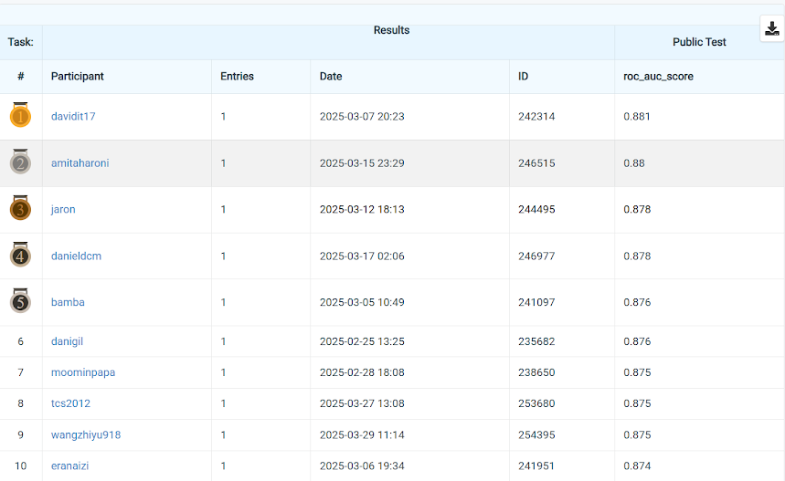

This repository contains my solution to the [MAFAT Web Activity Segmentation Challenge](https://www.codabench.org/competitions/3055/) ,

which focused on segmenting user activity from anonymized web data.

My approach achieved first place on the public leaderboard.

 

## 

- `davidit17_onepager.pdf` - A brief summary of the solution approach.
- `panel_preparation.ipynb` - Data preprocessing and feature engineering steps.
- `modeling.ipynb` - Model training and evaluation pipeline.
